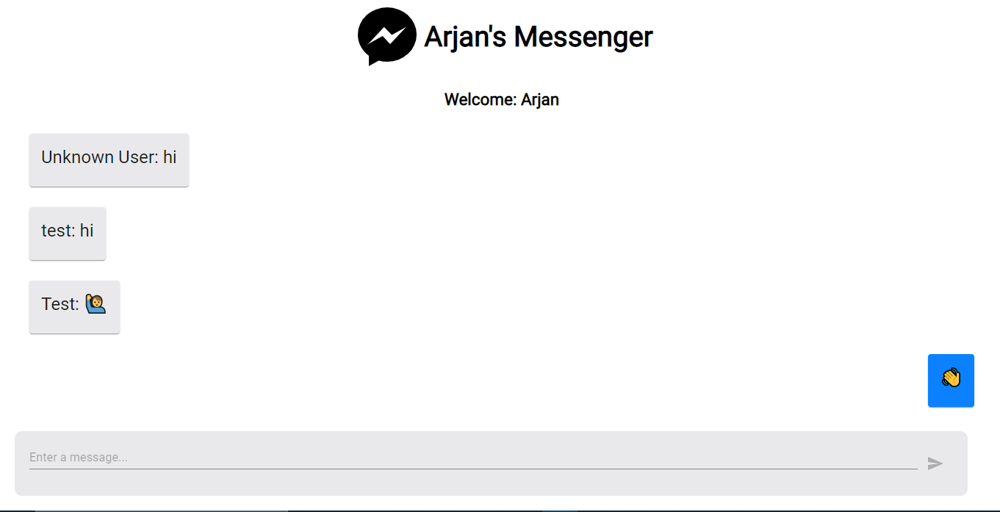
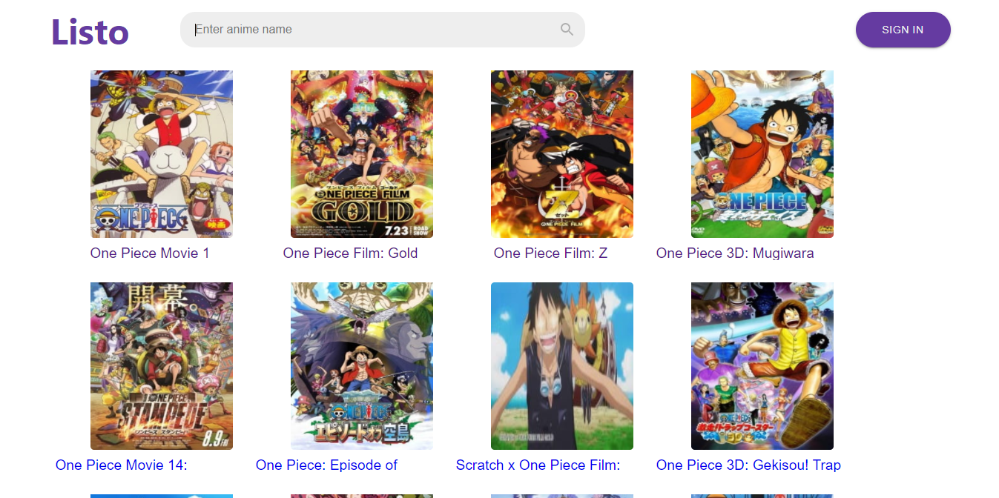
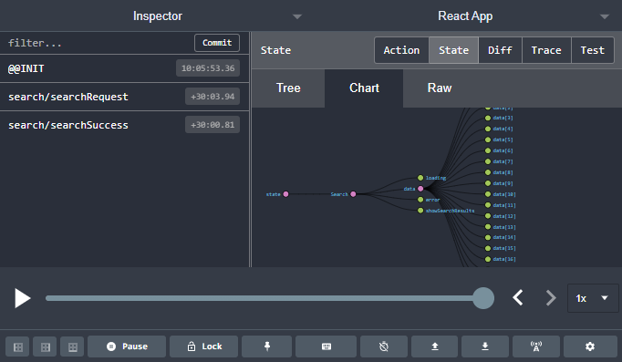

# My projects 

*	[STEGNO](https://github.com/arjansunar/Stegno) 🔏
--- 
    A project that creates a simple UI to let users send a steganographic image through Gmail and decode it.

        Topics learned:
            1.	State management: react context API
            2.	Image steganography: Lowest significant bit algorithm
            3.	Sending email via application: node-mailer
            4.	Rest API routes: node and express 
---

---

---
 

---

---

---
*	[MESSENGER-CLONE](https://github.com/arjansunar/messenger-clone) 
---
    Real time group chat application with react and firebase.

        Topics learned:
            1.	Real time actions: firebase firestore
            2.	React components
            3.	Connecting applications to an online
                    database service 
---

---

*	[LISTO](https://github.com/arjansunar/listo) 📃
---
    An anime search website that consumes and exiting API and manages state to show the requested anime.
        
        Topics learned: 
            1.	Managing routes: react-router 
            2.	State management: redux-toolkit
            3.	Consuming existing APIs: fetch API
---

---

    
---

*	[CRYPTO](https://github.com/arjansunar/crypto) 🔐
---
    A library that provides functions to implement encryption such as Vernam, Caesar,
    mono-alphabetic, and play-fair cipher.

        Topics learned: 
            1.	Creating Node modules
            2.	Implementing algorithms 
---